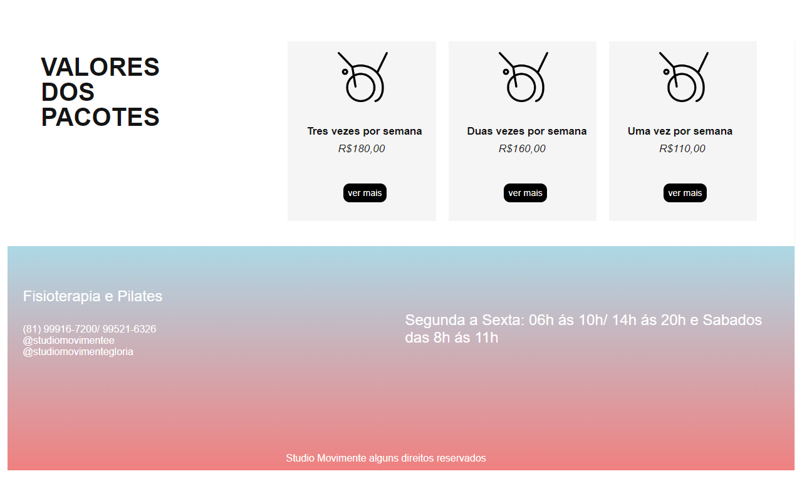

# LandPage-Studio-Movimente

Desenvolvi esse projeto como demonstração para uma clinica de pilates e fisioterapia, 
usar futuramente como um site próprio, tive como objetivo maior a estilização e aparência,  meu maior desafio nesse projeto foi tentar colocar todo ele responsivo, 
mas ainda sim tive bastante dificuldade, Aprendi a usar a propriedade "grid", e a colocar a proprieade linear gradient para as cores do header e footer.

##

# Objetivo do Projeto

Meu maior objetivo nesse projeto, foi deixar um site bastante apresentável e com uma aparência muito atraente, busquei melhorar mais em relação a estilização, e pesquisei muito a respeito de responsividade, flexbox, flexgrid.

##

# Tecnologias

* CSS
* HTML

##

# Gif e Imagens do Projeto

##

# Link para visualizar projeto em seu navegador.

Clique no link abaixo para ter uma experiência melhor visualizando o meu projeto em seu navegador.
